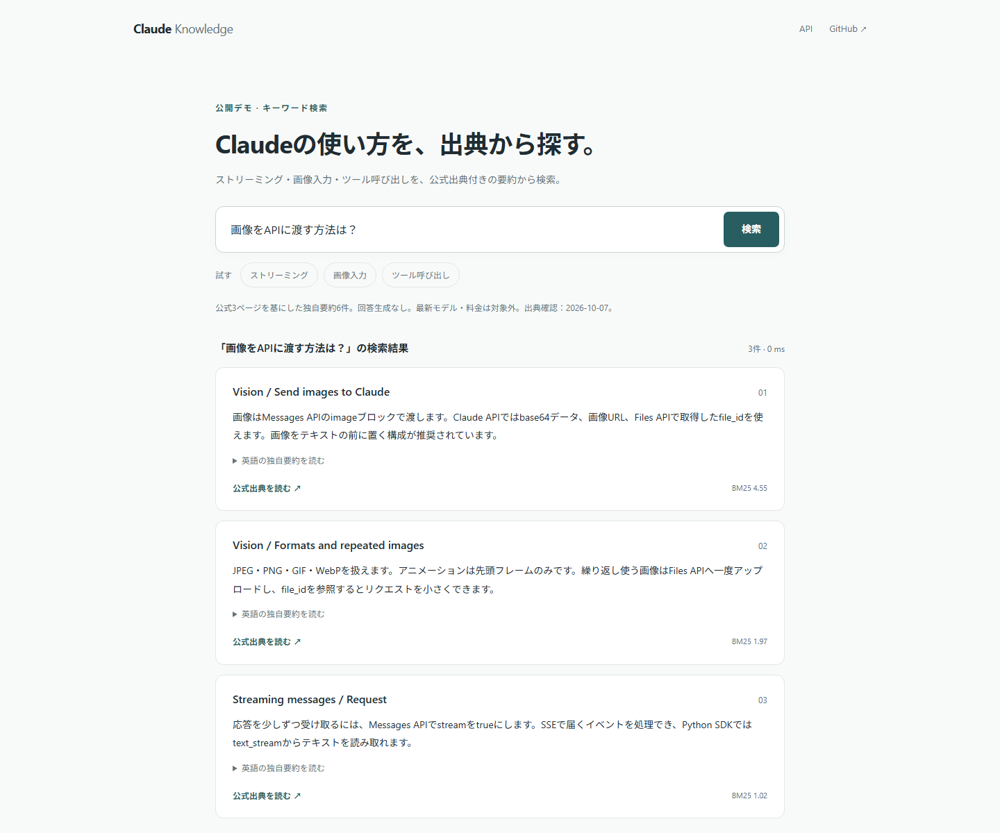
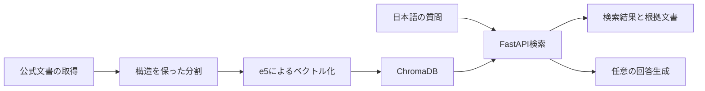

# Claude Knowledge Base

公式文書を収集・構造を保って分割し、ローカルのベクトルDBから検索するRAGアプリです。日本語の質問から英語の文書を探し、必要に応じて出典付きの回答を生成します。

**見どころ：正常に動く処理と、検索品質が保たれた処理を分けて検証したこと。**
チャンクがモデルの入力上限を超えていた問題を実トークナイザーで特定し、構造保持分割、検索評価、再開可能な差分更新へつなげました。

- [設計と改善の要点](docs/ENGINEERING_NOTES.md)
- [検索・回答品質の評価記録](docs/EVAL.md)
- [Windows検証の範囲](docs/WINDOWS_VALIDATION.md)

## ブラウザーで試す

**[公開の検索画面](https://claude-knowledge-base-portfolio.vercel.app/) ／ [公開のSwagger UI](https://claude-knowledge-base-portfolio.vercel.app/docs)**

インストール・APIキーは不要です。「画像をAPIに渡す方法は？」を検索し、結果から公式ページへ移動できます。Swagger UIでは `POST /search` → **Try it out** → 以下のJSON → **Execute** で検索できます。

```json
{"query":"画像をAPIに渡す方法は？", "top_k":3, "generate_answer":false}
```



ストリーミング・画像入力・ツール呼び出しに関する公式ドキュメント3ページを確認し、独自に作成した英語要約と日本語要約6件を検索します。本文は公式原文の転載ではありません。各結果に公式出典のURLを付けています。出典確認：2026-10-07。

| 試し方 | 検索方式 | 対象 |
|---|---|---|
| 公開デモ | BM25キーワード検索（英単語・日本語2文字単位） | 出典付き独自要約6件 |
| ダウンロード版のデモ | multilingual-e5-base＋ChromaDBの意味検索 | 同じ独自要約6件 |
| 通常版 | multilingual-e5-base＋ChromaDBの意味検索 | 自分で取得・登録した公式文書 |

公開デモは小さな索引を使う検索体験用です。順位・スコアはローカルのベクトル検索とは異なり、既存のRecall/MRR評価を再現するものではありません。回答生成はありません。公開版の配置方法は [DEPLOY.md](public_demo/DEPLOY.md) に記載しています。

## ダウンロードして意味検索を試す（Windows PowerShell）

Pythonが必要です。今回の確認環境と結果は [WINDOWS_VALIDATION.md](docs/WINDOWS_VALIDATION.md) を参照してください。

1. [ZIPをダウンロード](https://github.com/mndyant/claude-knowledge-base-portfolio/archive/refs/heads/main.zip)して展開し、`README.md` のあるフォルダーでPowerShellを開きます。Gitを使う場合は以下です。

   ```powershell
   git clone https://github.com/mndyant/claude-knowledge-base-portfolio.git
   cd claude-knowledge-base-portfolio
   ```

2. 仮想環境を作り、依存パッケージをインストールします。初回はtorchなどのダウンロードと展開に数分以上かかる場合があります。

   ```powershell
   python -m venv .venv
   .\.venv\Scripts\python.exe -m pip install -r requirements.txt
   ```

3. 初回はモデルを取得します。通信・ディスク容量・メモリが必要です。API利用料は発生しません。取得済みならキャッシュを再利用します。

   ```powershell
   .\.venv\Scripts\python.exe -c "from sentence_transformers import SentenceTransformer; SentenceTransformer('intfloat/multilingual-e5-base')"
   ```

4. 検索サーバーを起動します。このPowerShellは開いたままにしてください。

   ```powershell
   .\.venv\Scripts\python.exe -m scripts.portfolio_demo --serve
   ```

5. **サーバー起動後に**、同じPCのブラウザーで検索画面 `http://127.0.0.1:8001/` またはSwagger UI `http://127.0.0.1:8001/docs` を開きます。これらは自分のPCのアドレスなので、GitHubを見るだけでは開けません。ブラウザーだけで試す場合は上の公開デモへ進んでください。

「画像をAPIに渡す方法は？」を検索し、Visionの要約と公式出典を確認できます。モデルのキャッシュが見つからない場合は、手順3を同じ仮想環境・ユーザーで実行してください。8001番が使用中なら起動コマンドに `--port 18001` を追加し、ブラウザー側も18001へ変更します。

専用DBは `.portfolio-demo/` に作られ、再実行しても重複登録しません。個人用DB・APIキーは不要で、外部LLM・通知サービスを呼びません。終了は `Ctrl+C` です。

## 構成


```mermaid
flowchart LR
    A[公式文書の取得] --> B[構造を保った分割]
    B --> C[e5によるベクトル化]
    C --> D[ChromaDB]
    Q[日本語の質問] --> E[FastAPI検索]
    D --> E
    E --> F[検索結果と根拠文書]
    E --> G[任意の回答生成]
```

| 要素 | 技術・役割 |
|---|---|
| 取得 | requests / Beautiful Soup / tenacity |
| 分割 | Markdown構造保持、e5の実トークナイザーで上限確認 |
| 検索 | sentence-transformers / ChromaDB / FastAPI |
| 画面 | HTML / CSS / JavaScript。検索のみが初期設定 |
| テスト | pytest、HTTPモック、独立したテストDB |
| 更新 | GitHub Actionsの手動実行。テストCIはpush・PRで実行 |

## 検索品質の記録

以下は2026年7月に測定した既存の評価記録です。今回のサンプル4件による動作確認結果とは区別しています。母集団の異なる行同士を直接比較しないでください。

| 評価条件 | Recall@5 | MRR@10 |
|---|---:|---:|
| ベクトル検索・全体評価 | 0.875 | 0.7383 |
| SQLite FTS5・全体評価 | 0.375 | 0.2938 |
| 構造保持200/240・サブセット評価 | 0.925 | 0.8750 |

サブセット内の比較では、400→200トークンへの小チャンク化でMRR@10が0.8078→0.8750（差0.0672）。チャンク数と処理負荷が増えるため、全体への適用は見送っています。詳細・限界・評価条件は [EVAL.md](docs/EVAL.md) を参照してください。

## 公式文書を使う場合

```powershell
.\.venv\Scripts\python.exe scripts/fetch.py
.\.venv\Scripts\python.exe scripts/split_llms_full.py --input knowledge/docs/llms-full.md --output data/processed/chunks.jsonl --stats data/processed/stats.json
.\.venv\Scripts\python.exe scripts/reembed.py --input data/processed/chunks.jsonl
.\.venv\Scripts\python.exe -m uvicorn scripts.search_api:app --host 127.0.0.1 --port 8001
```

全量の取得・分割・埋め込みはサンプルより時間がかかります。収集文書・DB・配信状態は配布物に含みません。分割統計の `oversize_chunk_count == 0` と実トークナイザーの使用を確認してから登録します。

検索APIの例：

```json
{"query":"画像をAPIに渡す方法", "top_k":5, "generate_answer":false}
```

`generate_answer: false` はクエリ展開・回答生成を含め外部LLMを呼びません。通常起動で回答生成を選ぶ場合は `GEMINI_API_KEY` が必要です。既定値はAPI・画面とも無効（検索のみ）で、`generate_answer: true` を明示した場合だけ回答を生成します。利用APIの条件・モデルの提供状況は実接続前に確認してください。

設定は起動プロセスの環境変数から読みます。`.env.example` は変数名の参考で、`.env` の自動読込はしません。APIキーはOSや実行環境の秘密設定で渡し、コマンド例・Git履歴には記載しないでください。検索クエリの上限は4000文字です。

## テスト

```powershell
.\.venv\Scripts\python.exe -m pytest tests/ -q
```

単体・結合・E2EではHTTPをモックし、モデルを決定的なテストダブルへ置き換えています。実モデルでの検索はサンプルデモで別に確認します。検証環境と未確認範囲は [WINDOWS_VALIDATION.md](docs/WINDOWS_VALIDATION.md) に記載します。

## 公開範囲

更新・配信ワークフローは手動実行です。資格情報・既存DB・取得コンテンツ・個人用の運用資料は同梱しません。コードの公開ライセンスは著作権者表記とともに確定する予定です。公式文書そのものの権利とコードのライセンスは別です。

公開構成では配信状態をGitに保存しないため、手動digest workflowは毎回初回の記録のみとなり、継続配信には使えません。実運用には別途、状態の永続化と通知先の設定が必要です。更新workflowは文書・DBをダウンロード可能なartifactとして公開しません。
